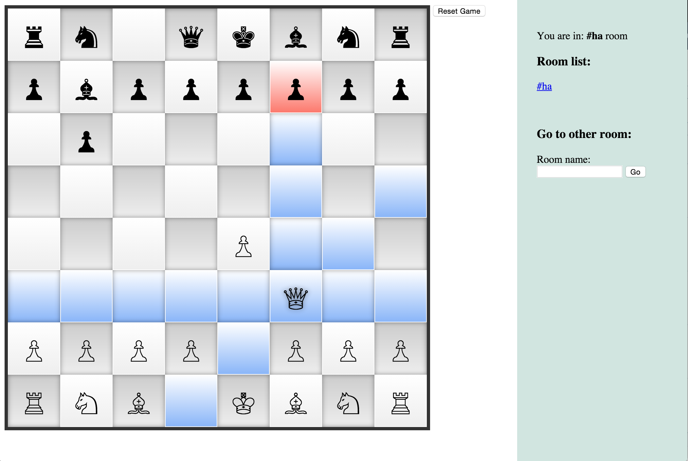

ChessJS
=======

**My very first semi-serious project in NodeJS**: Multiplayer Chess game.

# What it looks like

https://thawing-wave-3281.herokuapp.com/



# Features
- Play chess with your friend
- Support rooms: enter any room name (or append `#roomname` to URL) to create new room for you and your friend.

# Run

```
> npm install
> node server.js
```

Application run at `http://localhost:5000`
